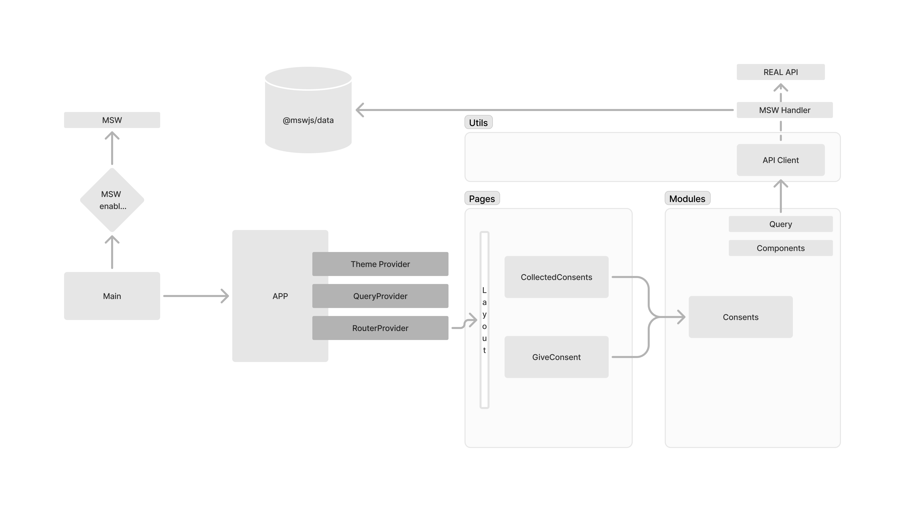

# Didomi homework

-   08.08.2024 - scaffold project
-   11.08.2024 - Add material, add initial components
-   12.08.2024 - Add MSW data, faker

## Approach

After reading the [requirements](https://github.com/didomi/challenges/tree/master/frontend) I listed the basic requirements from a tech stack pov.
We needed a simple app written in React and using Material UI, but we also needed to handle:

-   Bundling - [Vite](https://vitejs.dev/) - faster than webpack
-   Unit Tests - [Vitest](https://vitest.dev/) - Focuses on speed, mixes well with Vite
-   Unit Test Utility - [RTL](https://testing-library.com/) - closer to how users are using the app
-   E2E Tests - [Playwright](https://playwright.dev/)
-   Development Flow - [Storybook](https://storybook.js.org/) - easy component dev in isolation
-   BE 2 FE/API - [MSW](https://mswjs.io/), [ky](https://www.npmjs.com/package/ky) as http client, @mswjs/data for msw persistent data & faker for data mocking
-   A11y - [AXE](https://github.com/dequelabs/axe-core) but with [axe-playwright](https://github.com/abhinaba-ghosh/axe-playwright)
-   Linting - Eslint, Prettier, Stylelint
-   I18n - https://formatjs.io/docs/intl-messageformat/
-   ...
-   VITE [env variables](https://vitejs.dev/guide/env-and-mode)

When creating a new app there are a few challenges that need to be tackled

-   Tooling
-   Project structure
-   Business logic

I decided to "skip" the first 2 points and scaffold the project using an existing template selected based on the above libs. Why?
It would have taken me a lot of time and it's not worth it. Most of the tools are configuration based and it usually a trial and error process until you get the combination that fits best your project.

### Scaffold app

This app used [degit](https://github.com/Rich-Harris/degit) and a SPA [Vite template](https://github.com/bartstc/vite-ts-react-template) using the command `npx degit bartstc/vite-ts-react-template <folder>`
You can find more templates on the [vite awesome repo](https://github.com/vitejs/awesome-vite#templates)

## Basic commands

| Command                | Description                                                                                                                                                |
| ---------------------- | ---------------------------------------------------------------------------------------------------------------------------------------------------------- |
| `pnpm dev`             | Runs dev server with the HMR locally on port `5173`                                                                                                        |
| `pnpm dev:msw`         | Same as `pnpm dev` but enables MSW for mocked data                                                                                                         |
| `pnpm build`           | Builds optimized app package                                                                                                                               |
| `pnpm test`            | Runs unit tests                                                                                                                                            |
| `pnpm storybook`       | Runs a Storybook locally on port `6006`                                                                                                                    |
| `pnpm test-storybook`  | Runs integration tests (requires a running Storybook on port `6006` - more info [here](https://storybook.js.org/blog/interaction-testing-with-storybook/)) |
| `pnpm build-storybook` | Builds static app with [a Storybook's content](https://storybook.js.org/docs/react/sharing/publish-storybook)                                              |

## Nice to read

-   https://kentcdodds.com/blog/stop-mocking-fetch

## Dev Challenges

-   First time using this template
-   Need to spend some time understanding the project structure
-   Haven't worked too much with React Query & zustand
-   Need to clean up chakra UI and use Material

## Structure

The folder structure is as follows

-   **root** - the container for the entire project
-   **src** - All the files used in the app, also contains main.tsx, the entry point of the app
-   **src/app** - Contains the App component and Providers wrapper, placed here for ease of use
-   **src/mocks** - Contains the MSW files, faked DB, handlers, workers for browser and server
-   **src/modules** - Each domain entity should have a folder inside modules, will be lazy loaded
    -   /infrastructure - The "logic" layer - contains various logic, mainly business one, API logic etc
    -   /presentation - The "view" layer - Contains components, both dummy and smart
-   **pages** - Router + the minimal components for each page/route
-   **shared** - Shared elements/components that can be used by the app
-   **theme** - Should contain logic related to theming, can be moved to shared
-   **types** - Common types, should also be moved in shared
-   **utils** - old school utils folder

#### How the app works?

Running `pnpm dev:msw` starts the vite server that serves `main.tsx`.
Inside we check if the MSW server is enabled through the VITE_ENABLE_MSW env var, if this is true, then we import the browser worker and start it.
This will basically intercept all the network requests and handle them if there is a handler.

Then we render App.tsx wrapped by the providers, queryProvider, ThemeProvider and finally RouterProvider.
Router Provider is configured to server Layout as a wrapper, which also has an outlet in which the children routes are rendered.

Each page has it's own folder and is configured using the createBrowserRouter api, providing a loader and the lazy import.
The loader allows us to trigger the data queries before loading the page.

I decided not to use a client based state manager, and go all in with react query as a network state manager due to the simplicity of the app.
React query provides everything is needed for the state and app, along with "rehydratation" of the state when interacting with the entities (example: when we delete a consent the table is updated)

I use react-hook-form as it also provides everything needed for creating and managing forms, validation, error management etc.

As per the requirements, I updated the app to use material UI, having to remove Chakra.
Material UI provides for the basic A11y needs.
I also had to finalize the integration between msw, vitetest.

#### Remaining work

Unfortunately, I did not have time for the E2E tests but I would go with something like playwright.
I also wanted to update the translation mechanism to have typings as well
Another thing nice to have would be a changelog automation based on conventional commits.

## TODO

-   [x] Create basic diagram for the app
-   [x] Use Material UI instead chakra-ui
    -   [x] Install material
    -   [x] Clean up Chakra
-   [x] Decide on a way to store data (zustand vs signals)
    -   Need to drop Zustand
-   [ ] Implement a [changelog](https://changelog.md/)
-   [x] Write the components
-   [x] Write basic Unit tests
-   [ ] Write basic E2E tests
-   [x] Remove extra tool noise
-   [ ] Update translation mechanism

## Decision

### Data Storage

-   No data storage layer is needed due to the size of the app. Dropping Zustand

### Key features

-   Dev environment based on [ViteJS 5](https://vitejs.dev/) toolkit.
-   Testing environment based on [Vitest](https://vitest.dev/) and [Storybook 8](https://storybook.js.org/).
-   Static code analysis: eslint, prettier, husky.
-   TypeScript support.
-   [Devcontainer](https://code.visualstudio.com/docs/devcontainers/containers) config for VS Code.
-   [PNPM](https://pnpm.io/) as a package manager.
-   CI setup (automate tests, build, deploy draft) with [GitHub Actions](https://docs.github.com/en/actions).

### Key features

-   Everything that's included in the `basic` version.
-   Simple, modular, and accessible components based on [Chakra UI](https://chakra-ui.com/).
-   Data fetching and external state synchronization based on [React Query](https://tanstack.com/query/v4/).
-   Routing based on [React Router 6](https://reactrouter.com/en/main/start/overview).
-   ~~Date formatting based on [DayJS](https://day.js.org/).~~
-   Formatting tools for numbers, monetary values, and dates (easily extendable with any date library like [DayJS](https://day.js.org/)).
-   State management with [Zustand](https://docs.pmnd.rs/zustand/getting-started/introduction).
-   API mocking with [MSW](https://mswjs.io/).
-   A demo app with authentication presenting project structure, good practices, and used tooling in action (with a little help of [Fake Store API](https://fakestoreapi.com/docs)).
